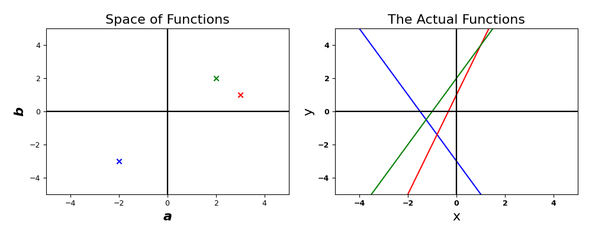
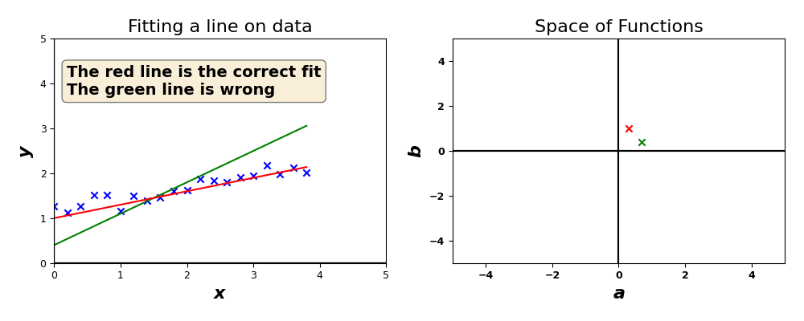

# A Function is a Point in Space.

## Key Concepts Covered here

1. Basis functions
2. Coefficients of the basis functions
3. A function is a point in space
4. Function class, Function Space, Hypothesis space

## Function as a point in space

If we look at the equation of a line&#x20;

$$
f(x) = ax + b,
$$

we may be accustomed to viewing the function $$f(x)$$ as a single entity where you plug $$x$$ into the function $$f$$ and get $$f(x)$$. Here, we invite you to change this original notation of a function, and instead view a function as a linear combination of other functions where

$$
f(x) = \alpha_1 \phi_1(x) + \alpha_2 \phi_2(x) + ... + \alpha_m \phi_m(x).
$$

If we apply this idea to the line, we would have&#x20;

$$
\begin{align*}
    f(x) & = ax + b \\
        & = a \phi_1(x) + b \phi_2(x) 
\end{align*},
$$

where

$$
\phi_1(x) = x \quad \phi_2(x) = 1    .
$$

We call the set of functions $$\{ \phi_1, \phi_2, ... \}$$ that construct $$f$$ as the **basis functions,** and we call the constant values in front of the basis functions as the **coefficients**.

Here, a line is really just a combination of two basis functions. These functions are very important because depending on the choice of these functions, we can construct vastly different shapes. For example, given a function of a parabola

$$
f(x) = a x^2 + bx + c.
$$

Not surprisingly, if we apply the idea of **basis function** to the parabola, we would get&#x20;

$$
\begin{align*}
    f(x) & = ax^2 + bx + c \\
        & = a \phi_1(x) + b \phi_2(x) + c \phi_3(x) 
\end{align*}.
$$

where $$\phi_1(x) = x^2 , \phi_2(x) = x , \phi_3(x) = 1$$.

Now, let's return our attention back to the line

$$
f(x) = a \phi_1(x) + b \phi_2(x).
$$

Notice that even after the basis functions are defined (assumed to be known), we still don't know the exact line unless we also define the coefficients $$(a,b)$$. This is the key insight we hope you will take away.&#x20;


Given that a set of basis functions is known, setting the coefficients defines exactly a function.&#x20;


While the previous statement may seem obvious, it actually has significant implications. Instead of looking at functions as something you plug a value in, we can view functions as a point in space as we define the coefficients. Using the linear function as an example, since choosing a value for $$(a,b)$$ give us a unique function, then every point in a 2d space is itself a function. We can visualize this idea with the plot below. On the left, it shows 3 potential points that to define $$(a,b)$$, and consequently, define 3 distinct linear functions. On the right side, we draw the actual function of lines that corresponds to the colors of the points. &#x20;

<figure><figcaption>
Figure 1
</figcaption></figure>

Understanding this perspective on function, by initially defining the **basis functions**, it allows us to represent distinct functions as points in space. This is an incredibly useful way to look at functions because **it allows us to conceptualize and visualize functions as points.** Moreover, everything we have learned in linear algebra can be applied to manipulate functions.&#x20;


We call this space where each point is a function, the **function space**, the **hypothesis space,** or the **function class.** The **function space** basically represents all the possible functions contained within the space given the basis functions.&#x20;


We will denote the hypothesis space with the symbol

$$
\mathcal{H}.
$$

Following this new understanding of functions, we go back to the problem of linear regression. Below, we show on the left in blue a set of data that we wish to fit into the best line possible. By looking at the plot, it is obvious that the red line is the appropriate fit while the green line is the wrong fit.&#x20;

<figure><figcaption>
Figure 2
</figcaption></figure>

In linear regression, we are forming a **hypothesis** that by using the **basis functions of**&#x20;

$$
\phi_1(x)= x, \quad \phi_2(x)=1,
$$

the target function, $$f^*$$, is within this 2d function space. If $$f^*$$ is actually within our **hypothesis space,** we would say that $$f^*$$ is an element of $$\mathcal{H}$$, symbolically denoted as

$$
f^* \in \mathcal{H}.
$$

Of course, just because we have chosen the basis functions, it is just a hypothesis, a best guess. It doesn't guarantee that our hypothesis space will contain the target function. The linear regression shown in Figure 2 is an example where $$f^* \in \mathcal{H}$$. Now we will show you a 2nd example where the target function is outside of our hypothesis where $$f^* \not\in \mathcal{H}$$.&#x20;

Let's assume that we have a target function

$$
f^*(x) = c x^2 + b x + a,
$$

where the basis functions are&#x20;

&#x20;

