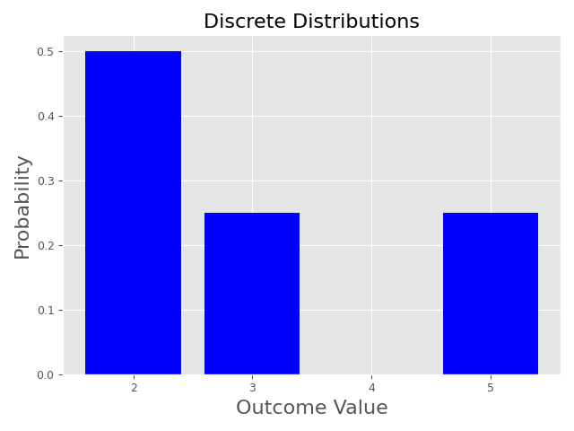
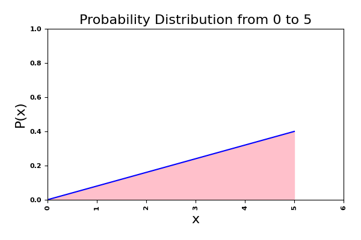

# Expectation

Given 4 numbers, $$\mathbf{x}$$ = {2,3,5,2}, we are familiar with the idea of the **average**. In this simple example, the average would be

$$
Avg(\mathbf{x}) = \frac{2 + 3 + 5 + 2}{4} = 3.
$$

​In statistics, this is also known as the **Arithmetic Mean,** or most of the time we just call it the **mean.**  Another way to look at the average value is through the concept of **expectation**. The equation for the expectation of the random variable $$X$$ is

$$
\mathbb{E}[X] = \sum_{i=1}^n x_i P(x_i).
$$

Here, $$P(x_i)$$​ is the probability of getting a particular value for $$x$$​. The sigma symbol $$\sum_{i=1}^n$$ says that we are going to sum up all the $$x_i$$values from $$i=1$$ to $$i=n$$. Also take note of the expectation symbol, $$\mathbb{E}$$; this is different from a standard $$E$$.

To see a more concrete example, we use the same data of $$\mathbf{x}$$​ = {2,3,5,2}. Here the possible values in $$\mathbf{x}$$ are {2,3,5}. Since there are 3 values $$n$$ is 3 where $$x1 = 2, x_2=3, x_3 =5.$$

we can say that&#x20;

* since 2 out of 4 numbers are 2s, the probability of getting a 2 is 2/4, or $$P(x=2) = \frac{2}{4};$$&#x20;
* since 1 out of 4 numbers is a 3, the probability of getting a 3 is 1/4, or $$P(x=3)=\frac{1}{4};$$​
* since 1 out of 4 numbers is a 5, the probability of getting a 5 is 1/4, or $$P(x=5)=\frac{1}{4}$$.

We can view this probability distribution with the image below.&#x20;

<figure><figcaption></figcaption></figure>

Using this chart, we can say that the expectation is calculated with the following method. First remember that this is the equation for expectation:

$$
\mathbb{E}[X] = \sum_{i=1}^n x_i P(x_i).
$$

​Here is the same equation if we write out all the terms:

$$
\mathbb{E}[X] = \underbrace{x_1 \times P(x = x_1)} + \underbrace{x_2 \times P(x = x_2)} + \underbrace{x_3 \times P(x = x_3)}.
$$

Now we can plug the values in.&#x20;

$$
\mathbb{E}[X] =  \underbrace{2 \times \frac{2}{4}}_{x_1} + \underbrace{ 3 \times \frac{1}{4} }_{x_2} + \underbrace{5 \times \frac{1}{4}}_{x_3} = \frac{2 + 3 + 5 + 2}{4} = 3.
$$

​Notice that while the idea of expectation and mean/average are different, they actually give us the same results. By observing this, we might be tempted to simply say that the idea of **expectation** is the same as the **mean/average,** and that would be the wrong assumption.

In reality, **expectation** is a significantly more powerful concept compared to **mean/average**. This is because while expectation can also compute the mean and average, it is much more difficult to use mean to obtain the expectation. We can make this clear by looking at another example. Let's assume instead of just 3 possible numbers we previously used, we now can have any number between 0 to 5. To further complicate the situation, the numbers all have different probabilities of occurrence. Since between 0 to 5, counting all the fractional numbers, it has infinite possibilities, it would be impossible to manually add all the values up.&#x20;

The conceptual idea of expectation allows us to convert the summation into an infinite sum through the usage of integrals. That is, we would convert the previous equation

$$
\mathbb{E}[X] = \sum_{i=1}^n x_i P(x_i)
$$

​into

$$
\mathbb{E}[X] = \int_X x P(x) dx.
$$

​This implies that as long as we can represent the probability as a function, we can now calculate the expectation even if there are infinite possible values.&#x20;

Let's now do an example calculating the expectation for a particular probability distribution. Let's assume again that the possible values go from 0 to 5 and $$P(x) = \frac{2}{25} x$$. This means that $$P(x=0)$$​ would be 0 and $$P(x=1)$$​ would be $$\frac{2}{25}$$​. We can easily get these values by plugging in 0 or 1 into the equation $$\frac{2}{25}x$$​. We plot the function $$P(x)$$​ below.

<figure><figcaption></figcaption></figure>

Since this function is a probability distribution, the summation of the area in pink should be 1. We can confirm this by taking the area of the triangle. Note that the width of the triangle is 5 and the height is 0.4, then the area can be calculated as

$$
\frac{0.4 \times 5}{2} = 1.
$$

From our calculus class, we also know that the area under the curve can be calculated via an integral of the function from 0 to 5 where we have

$$
1 = \int_0^5 \frac{2}{25}x \; dx = \frac{2}{25 \times 2} x^2 \bigg|_0^5 = \frac{2 \times 25}{25 \times 2}.
$$

​Now that we have confirmed that the probability distribution is valid summing up to 1. We can now compute the expectation integral as well.&#x20;

$$
\mathbb{E}[X] = \int_0^5 x \; P(x) \; dx
$$

We now plug in $$P(x)$$​ into the integral.

$$
\mathbb{E}[X] = \int_0^5 x \; \frac{2}{25} x \; dx = \int_0^5 \; \frac{2}{25} x^2 \; dx = 3.3333..
$$

Now that we have found that the expectation is 3.3333\~, there is also a physical interpretation of this value. Pretend that we had to place a stick under this triangle, where should the stick be placed so the triangle is perfectly balanced? The answer is the center of gravity. It turns out that the expectation is also the center of gravity. Therefore, if we had placed the stick exactly at 3.3333\~, then the triangle would balance perfectly on the stick.&#x20;

So far, we talked about the difference between mean/average and expectation. If we don't know the probability distribution $$P(x)$$​ and only have the data itself, expectation acts just like mean and average. However, if we do know $$P(x)$$​, then expectation allows us to calculate the notation of the average when we have infinite points.&#x20;

## Expectation of a function of $$X$$

If we continue with out previous example $$\mathbf{x} = \{2,3,5,2\}$$. We have discussed how we can find the expectation of $$\mathbf{x}$$ via&#x20;

$$
\mathbb{E}[X] = \sum_{i=1}^n x_i P(x_i).
$$

But what if instead of finding $$\mathbb{E}[X]$$, we want to first map every value in $$X$$ to a another value via the function $$f(X)$$, then find the expected value of the newly mapped values?  More specifically, how do we find $$\mathbb{E}[ f(X)]$$?

To gain an intuition on finding the expecation for a function of $$X$$, let's use the our previous example of {2,3,5,2}. For this case, let's pretend for now that the function $$f(x)$$ is the following equation.&#x20;

$$
f(x) = 2x.
$$

So what we are essentially is saying via $$\mathbb{E}[f(X)]$$ is that we first take the values of $$\mathbf{x}$$, and pass it through the equation $$f(x) = 2x$$, this results in 2 x {2,3,5,2} = {4,6,10,4}, then we find the expectation of the new values, which gives us

$$
\mathbb{E}[f(X)] = \frac{4+6+10+4}{4} = 6.
$$

&#x20;From this example, we can see that the equation to find $$\mathbb{E}[f(X)]$$ with discrete possible values is

$$
\mathbb{E}[f(X)] = \sum_{i=1}^n f(x_i) P(x_i),
$$

and for continuous problems, we have the equation

$$
\mathbb{E}[f(X)] = \int f(x) p(x) \; dx.
$$
